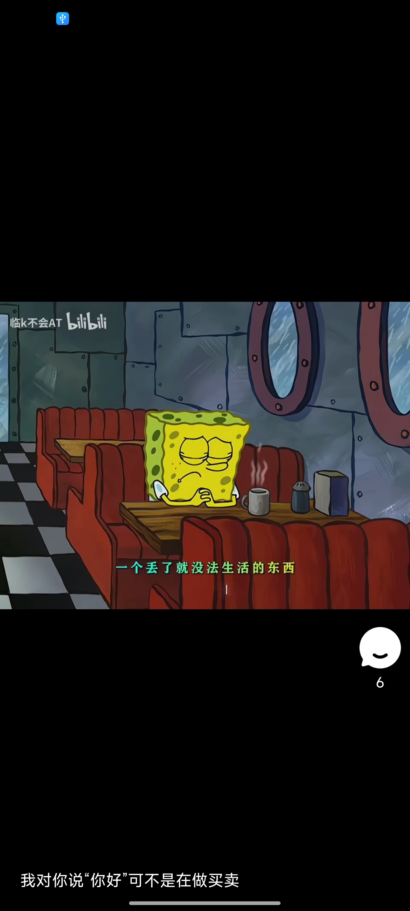

# strong

**Android 短视频播放器，基于 Bilibili 逆向 API 获取视频数据，使用 dkplayer 实现滑动流畅播放。**

项目采用预加载+Android官方缓存技术，保证视频间切换的流畅性。通过 VerticalViewPager + PreloadManager 实现滑窗预加载策略，在用户体验和内存占用之间取得平衡。

## 界面展示




## 项目特点

- **仿抖音滑动播放** — 基于 VerticalViewPager 实现无限上下滑动，配合滑动窗口预加载机制，切换视频丝滑流畅
- **Android 官方缓存** — 采用预缓存 + 播放缓存分离策略，避免重复下载，降低播放延迟
- **Bilibili 真实数据** — 通过逆向 B 站 HTTP API 获取视频列表、播放链接等真实数据
- **LitePal 本地持久化** — 视频列表数据先入库再展示，减少网络请求依赖

## 技术栈

| 组件 | 用途 |
|---|---|
| dkplayer | 视频播放器（底层 ExoPlayer），支持预加载、无缝切换 |
| ExoPlayer | 核心播放引擎 |
| Retrofit2 | Bilibili HTTP API 接口请求 |
| LitePal | 视频列表本地持久化 |
| Glide | 封面图、头像等图片加载 |
| Android官方缓存 | 视频文件磁盘缓存 |

## 项目结构

```
app/src/main/java/com/ygl/strong/
├── app/            — Application，全局初始化
├── base/           — Activity / Fragment 基类
├── db/             — 数据库表定义 (LitePal)
├── http/           — Bilibili API 接口 (Retrofit + OkHttp)
├── ui/             — 主界面、列表、播放等 UI 层
├── utils/          — 工具类，包括视频缓存引擎
├── utils/videocache/         — Android官方缓存源码
├── utils/videocache/strong   — 自定义预缓存策略
└── widget/         — VerticalViewPager、TikTokView 等自定义组件
```

## 数据流

```
打开 APP → LauncherActivity → 获取视频列表并写入 DB → MainActivity
→ 从 DB 读取视频列表 → PreloadManager 预加载 → 首次缓存就绪后播放
→ 滑动切换 → 新视频进入预加载列表 → 旧视频释放
```

## 运行

1. 将 `constants.properties.example` 复制为 `constants.properties`
2. 填入 `BILIBILI_COOKIE`（需要登录 B 站后从浏览器或 App 获取，用于 API 请求鉴权）
3. 填入其他值，具体见constants.properties.example
4. 使用 Android Studio 打开项目根目录，Sync Gradle 后运行

## 使用的开源库

- [dkplayer](https://github.com/Doikki/DKVideoPlayer) — 视频播放器框架
- [retrofit2](https://github.com/square/retrofit) — HTTP 请求
- [LitePal](https://github.com/guolindev/LitePal) — 数据库操作
- [Glide](https://github.com/bumptech/glide) — 图片加载
